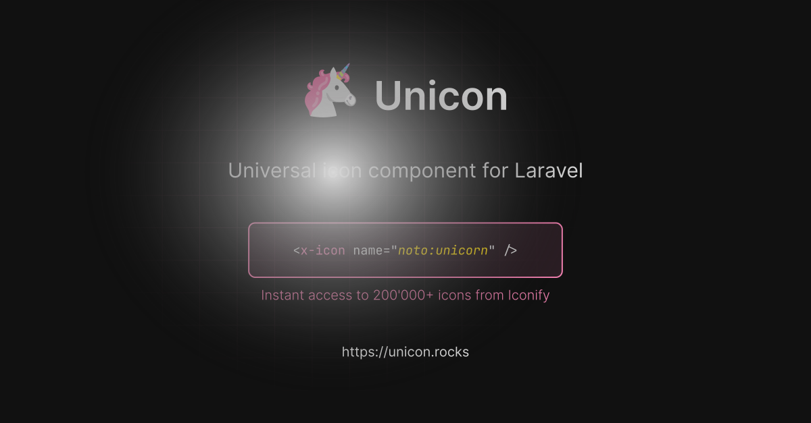

[](https://unicon.rocks)


Unicon is a package for [Laravel] that enables seamless, on-demand integration of over 200,000 icons from the [Iconify] API, with caching for optimized performance.

[Laravel]: https://laravel.com
[Iconify]: https://iconify.design/

# Installation

You can install the package via [Composer] by running the following command.

```bash
composer require hedger/unicon
```

[Composer]: https://getcomposer.org

## Documentation

The full documentation can be found at [unicon.rocks](https://unicon.rocks).

## License

Unicon is open-source software licensed under the [MIT license](LICENSE).
